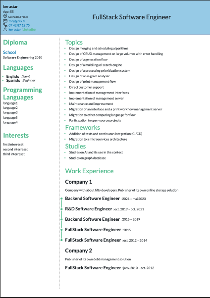

# JSON Resume Template simple

This project provides a **resume template** that can be used with the external project [CV_generator_from_JSON](https://github.com/corentinffoucault/CV_generator_from_JSON).

This project generates HTML resumes that can be converted to ATS-friendly PDFs using Puppeteer.

Type safety is ensured by the submodule [json_cv_schema](https://github.com/corentinffoucault/json_cv_schema)
---

## ATS-Friendly Resume Cheat Sheet

Quick tips to make your resume readable by Applicant Tracking Systems (ATS):

### File Format
- **PDF** (selectable text) or **Word (.docx)**
- **Avoid** images, scanned PDFs, JPG/PNG

### Fonts & Text
- Use simple fonts: Arial, Calibri, Helvetica, Times New Roman, **Lato**
- **Disable ligatures** (`fi`, `fl`) to ensure each character is recognized
- Avoid columns, text boxes, graphics, or icons

### Structure & Sections
- Standard headings: `Experience`, `Education`, `Skills`, `Languages`, `Certifications`
- Reverse chronological order for experience
- Keep layout linear and simple

### Content & Keywords
- Include exact keywords from job postings (e.g., `C++`, `Python`, `Docker`)
- Spell out abbreviations (e.g., `CI/CD (Continuous Integration / Continuous Deployment)`)
- Technical skills in a **dedicated section**
- Dates in `MM/YYYY – MM/YYYY` or `YYYY` format

### Additional Tips
- Keep your resume **1-2 pages max**
- Links are okay as plain text (e.g., `https://github.com/yourprofile`)
- Quick test: copy-paste into a text editor → should remain readable and ordered


---

## Preview



---

## Purpose

The template is designed to generate a clean and modern **HTML CV** from a structured **JSON resume** that can be converted to ATS-friendly PDFs using Puppeteer.
It can be reused across projects, making it easy to keep your resume consistent, customizable, and portable.

---

## Installation

Requirements:
- **Node.js** v22 or higher
- **npm** v11 or higher

```bash
git clone --recurse-submodules https://github.com/corentinffoucault/typescript_cv_template_ATS_friendly.git
cd typescript_cv_template_simple
npm install-recursive
npm run build
``` 

---

## How to use

This repository is not meant to be used directly.  
Instead, it acts as a **template dependency** for [CV_generator_from_JSON](https://github.com/corentinffoucault/CV_generator_from_JSON).

To see how to use it you can read this [readme](https://github.com/corentinffoucault/CV_generator_from_JSON)

---

## Test

Tests have been added to ensure the stability and reliability of the project.
To run them, use the following command:

```bash
npm run test
```

---

The tests verify that the template correctly generates the expected files and conforms to the JSON schema defined in json_cv_schema